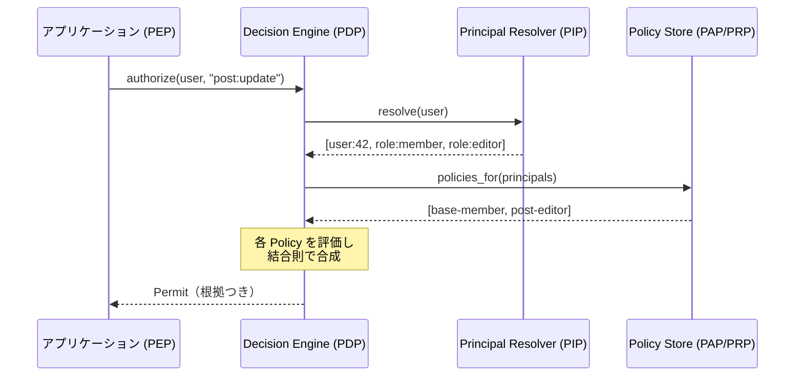
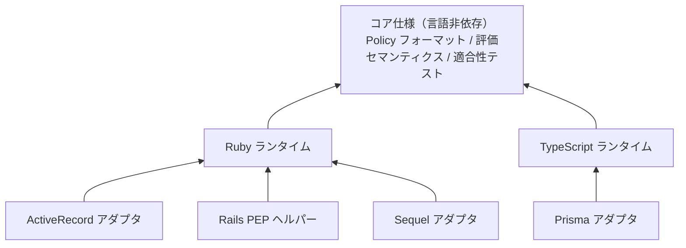

# 権限管理ライブラリ コンセプトドキュメント

- Status: Draft
- 作成日: 2026-07-11
- 名称: placet（読み: プラケット）— ラテン語「可とする」。大学・教会の採決用語 placet / non placet（可 / 否）に由来し、principal たちの評決として決定を返す本ライブラリの性格を表す

## 1. 目的と背景

アプリケーションの認可 (authorization) を、アプリケーションコードのロジックから分離し、宣言的に定義された Policy の評価として実現する仕組みを提供する。

大きな方向性は、**AWS IAM のモデル（principal への policy アタッチ、explicit deny の優先、implicit deny）を簡略化し、一般のアプリケーションに導入できるようにする**ことである。権限モデルのメンタルモデルは IAM から、評価器の内部構造（役割分離と結合アルゴリズム）は XACML のアーキテクチャ（PEP / PDP / PIP / PAP・PRP）から借りる。XACML の XML ベースの重厚さは避け、軽量で理解しやすいモデルを目指す。

実装言語・フレームワークは現時点では決めない。複数言語での実装も視野に入れるため、**Policy の表現形式と評価セマンティクスを言語非依存の仕様として定義し、各言語のライブラリはその仕様のランタイム実装**という位置づけとする（実装の層構造は Section 9、定義フォーマットは Section 10）。

## 2. 設計原則

- **宣言的**: 権限はコード中の条件分岐ではなく、静的に定義された Policy で表現する
- **静的定義**: Policy はコード / 設定ファイルで定義し、デプロイで反映する。コードレビューと監査が可能
- **合成可能**: 複数の Policy は明確な計算則（結合アルゴリズム）のもとで単一の決定に合成できる
- **デフォルト拒否 (implicit deny)**: どの Policy にもマッチしない場合は拒否する
- **明示的拒否の優先 (deny-overrides)**: 1 つでも deny があれば拒否する。結合則はこの 1 つに固定し、設定による差し替えは提供しない。同じ Policy 群は常に同じ結果を返す
- **動的な状態は principal 導出で吸収する**: 実行時に変化するのはアクセスユーザーの principal 集合だけであり、Policy と attachment はデプロイ時に固定される。権限の動的な変更は「どの principal を持つか」の変化として表現する
- **言語非依存**: Policy フォーマットと評価セマンティクスは仕様として定義し、実装から独立させる
- **説明可能**: すべての決定は、どの Policy のどの statement によるものかという根拠つきで返される

## 3. コアコンセプト

### 3.1 Principal

アクセス主体を「面」ごとに表す識別子。`<type>:<id>` の形式をとる。

```
user:42          # 個人としての面
role:editor      # 役割としての面
tenant:acme      # 所属テナントとしての面
group:sales      # 所属グループとしての面
```

1 人のアクセスユーザーは**複数の principal を同時に持つ**。type はライブラリ側で固定せず、アプリケーションが自由に定義できる。

### 3.2 Principal の導出

リクエスト時に、アプリケーション DB のユーザー情報・所属情報などから、アクセスユーザーの principal 集合を解決する。この解決ロジック（Principal Resolver）はアプリケーション側が実装する。XACML の PIP に相当する。

```
resolve(user) -> [user:42, role:member, role:editor, tenant:acme]
```

リソース個体認可（Section 8）では、resolver は対象リソースも受け取り、そのリソースとの「関係」を principal の一つの面として追加導出する。

### 3.3 Action

操作を「リソース × 操作」で表す識別子。`<resource>:<operation>` の形式をとる。リソース名は小文字 snake_case の単数形、operation も小文字 snake_case とする。

```
post:view
post:update
comment:create
```

**ワイルドカード**: 各セグメントは、リテラルか `*` のどちらかである。部分文字列のパターン（`po*`、`v*w` など）は許さない。この規則から次の 4 形式が導かれる。

| 形式 | 意味 | 用途の例 |
|---|---|---|
| `post:view` | 完全一致 | 通常の指定 |
| `post:*` | post に対する全操作 | リソース管理者 |
| `*:view` | 全リソースの view 操作 | 読み取り専用ロール・監査ロール |
| `*`（`*:*` の短縮形） | 全 action | 凍結（deny-all）、スーパーユーザー |

ワイルドカードは allow / deny のどちらの statement でも使える（例: `*:delete` を deny）。なお `*:view` のような operation 側の横断指定が意味を持つのは operation の命名が一貫している場合に限られるため、標準動詞（`view` / `create` / `update` / `delete`）を揃える命名規約を推奨する。

### 3.4 Policy と Statement

**Statement** は effect（`allow` | `deny`）と対象 action 集合の組。**Policy** は名前を持つ Statement の集合であり、認可ルールの再利用単位となる。

```yaml
policies:
  - name: post-editor
    statements:
      - effect: allow
        actions: [post:create, post:update, post:delete]
```

### 3.5 Attachment

Policy を principal に紐づける定義。1 つの principal に複数の Policy を、1 つの Policy を複数の principal にアタッチできる（多対多）。

```yaml
attachments:
  - principal: role:editor
    policies: [post-editor]
```

principal のマッチングは**完全一致のみ**とし、`tenant:*` のようなパターンは認めない。「全テナントのメンバー」のような集約が必要な場合は、resolver が共通の principal（例: `tenant-member`）を導出して表現する。これは「動的な状態は principal 導出で吸収する」原則の適用であり、attachment のマッチングを自明に保つ。

### 3.6 Decision

評価の結果を表す値。評価の途中では 3 値をとる。

| 値 | 意味 |
|---|---|
| `Permit` | 許可する statement にマッチした |
| `Deny` | 拒否する statement にマッチした |
| `NotApplicable` | マッチする statement がなかった |

最終的な決定は 2 値（`Permit` / `Deny`）であり、`NotApplicable` は implicit deny により `Deny` に畳み込まれる。

決定は 2 値の結果だけでなく、**根拠を含む構造体**として返される。

```yaml
# authorize(user, "post:update", post) の返り値のイメージ
decision: deny
basis: explicit_deny          # explicit_allow | explicit_deny | implicit_deny
determinants:                 # 決め手になった statement（implicit_deny のときは空）
  - principal: flag:suspended # どの principal 経由で
    policy: suspended         # どの Policy の
    statement: 0              # 何番目の statement が
    effect: deny
```

- `implicit_deny`（何もマッチしなかった）と `explicit_deny`（deny にマッチした）が区別できるため、「権限が付与されていない」のか「明示的に禁止されている」のかをデバッグ・監査で切り分けられる
- 実装は deny-overrides の性質上、最初の `Deny` で評価を短絡してよいが、`determinants` には決め手となった statement を最低 1 件含めなければならない。マッチした statement を全件収集するモード（explain モード）は任意機能とする
- この構造体は監査ログにそのまま記録できる。一方で**エンドユーザーにそのまま提示してはならない**。Policy の構成や他者の権限情報の漏洩につながるためで、ユーザー向けメッセージへの変換はアプリケーションの責務とする

## 4. アーキテクチャ（XACML との対応）

| 本ライブラリの構成要素 | 役割 | XACML 相当 |
|---|---|---|
| Enforcement（アプリ内の認可チェック呼び出し） | 認可が必要な箇所で決定を要求し、結果を強制する | PEP (Policy Enforcement Point) |
| Principal Resolver | アプリ DB からアクセスユーザーの principal 集合を導出する | PIP (Policy Information Point) |
| Policy Store | 静的に定義された Policy / Attachment を保持・検索する | PAP / PRP |
| Decision Engine | Policy 群を action に対して評価し、結合則で合成する | PDP (Policy Decision Point) |
| Combining Algorithm | 複数の評価結果を単一の決定に畳み込む計算則 | Policy Combining Algorithm |



## 5. 評価フロー

```
function decide(user, action):
    principals = PrincipalResolver.resolve(user)        # 1. principal 導出
    policies   = PolicyStore.policies_for(principals)   # 2. Policy 収集
    results    = policies.map { |p| evaluate(p, action) } # 3. 個別評価
    decision   = combine(results)                       # 4. 合成（deny-overrides）
    return to_result(decision)                          # 5. 根拠つき構造体（3.6）を返す
```

1. **Principal 導出** — アクセスユーザーから principal 集合を解決する
2. **Policy 収集** — 各 principal にアタッチされた Policy をすべて集める
3. **個別評価** — 各 Policy を要求 action に対して評価する。action にマッチする statement の effect が結果となり、マッチがなければ `NotApplicable`。1 つの Policy 内で複数の statement がマッチした場合も deny-overrides で合成する（deny の statement が常に勝つ）
4. **合成** — 全 Policy の評価結果を deny-overrides で単一の決定に畳み込む
5. **最終決定** — `NotApplicable` のままなら implicit deny により `Deny`。結果は決め手となった statement を含む構造体（3.6）として返す

## 6. Policy の合成則

結合アルゴリズムは **deny-overrides のただ 1 つに固定**する。設定による差し替えは提供しない。これは AWS IAM の評価論理と同じであり、Policy 群を読めば結果が一意に予測できることを保証するための決定である。Policy 内の statement の合成にも、Policy 間の合成にも、同じこの規則を適用する。

### 6.1 規則

評価結果の集合に対して、次を上から順に適用する。

| 条件 | 決定 |
|---|---|
| 1 つでも `Deny` がある | `Deny` |
| `Deny` がなく、1 つでも `Permit` がある | `Permit` |
| すべて `NotApplicable`（または評価対象が空） | `NotApplicable` → implicit deny により最終的に `Deny` |

したがって `Permit` になるのは「**少なくとも 1 つの allow にマッチし、かつどの deny にもマッチしない**」場合のみである。allow と deny が競合したときは常に deny が勝つ（`allow × deny → deny`）。

この規則の帰結として、**deny に「例外」を作ることはできない**。deny にマッチする以上、他のどんな allow でも覆せないため、「原則禁止だが特定の principal のみ許可」が必要な場合は、deny の対象範囲そのものを狭めて定義する必要がある。これも IAM と同じ挙動である。

### 6.2 代数的性質

deny-overrides は、決定値に `Deny` > `Permit` > `NotApplicable` の順序を与えた上での最大値をとる演算である。この演算は可換・結合的・冪等で、`NotApplicable` を単位元とするモノイドを成す。このことから次の性質が導かれる。

- **評価順序に結果が依存しない** — Policy をどの順に評価しても同じ決定になる
- **Policy の境界が意味論に影響しない** — Policy 単位で畳んでから合成しても、全 statement をフラットに並べて畳んでも、結果は同じになる。Policy はあくまで定義の管理・再利用の単位であり、評価意味論上のスコープではない
- **空集合の畳み込みは `NotApplicable`** — マッチする Policy が 1 つもない場合の implicit deny が、特別扱いではなく単位元から自然に導かれる

これらの性質は、一覧フィルタリングの scope 合成（8.4）が evaluate と同じ結果を返すことの根拠にもなる。

### 6.3 採用しなかった選択肢

比較検討の記録として残す。

- **permit-overrides**（1 つでも `Permit` があれば許可）: deny の Policy を allow で上書きできてしまい、「deny をアタッチすれば確実に止められる」という安全側の保証（ケース 2 の凍結など）が失われる
- **first-applicable**（順に評価し、最初に `NotApplicable` でなかった結果を採用）: Policy は複数の principal へのアタッチから**集合として**収集されるため、このアルゴリズムを採るには評価順序を仕様として別途定義する必要が生じる。また順序依存は Policy 単体の可読性を損なう
- **結合則の差し替え可能化**: 同じ Policy 群でも設定次第で結果が変わることになり、Policy を読んだだけでは意味が確定しなくなる。「IAM の簡略化」という目的と逆行する

## 7. 具体例

```yaml
policies:
  - name: base-member
    statements:
      - effect: allow
        actions: [post:view, comment:view, comment:create]

  - name: post-editor
    statements:
      - effect: allow
        actions: [post:create, post:update, post:delete]

  - name: suspended
    statements:
      - effect: deny
        actions: ["*"]   # 全 action の deny（ワイルドカードの仕様は 3.3）

attachments:
  - principal: role:member
    policies: [base-member]
  - principal: role:editor
    policies: [post-editor]
  - principal: flag:suspended
    policies: [suspended]
```

**ケース 1: 編集者が投稿を更新する**

- user 42 の principal 導出結果: `[user:42, role:member, role:editor]`
- 収集される Policy: `base-member`, `post-editor`
- `post:update` に対する評価: `base-member` → `NotApplicable`、`post-editor` → `Permit`
- deny-overrides で合成 → **Permit**（basis: `explicit_allow`, determinant: `post-editor` / `role:editor` 経由）

**ケース 2: 凍結された編集者が投稿を更新する**

- principal 導出結果: `[user:42, role:member, role:editor, flag:suspended]`
- 収集される Policy: `base-member`, `post-editor`, `suspended`
- 評価: `post-editor` → `Permit`、`suspended` → `Deny`
- deny-overrides により `Deny` が優先 → **Deny**（basis: `explicit_deny`, determinant: `suspended` / `flag:suspended` 経由）

「凍結」を principal の一つの面（`flag:suspended`）として表現し、deny の Policy をアタッチするだけで全操作を止められる。これが principal を多面的に持たせるモデルの利点である。

**ケース 3: 一般メンバーが投稿を削除する**

- principal 導出結果: `[user:7, role:member]`
- 収集される Policy: `base-member` のみ
- `post:delete` に対する評価: `NotApplicable`
- マッチする Policy がない → implicit deny → **Deny**（basis: `implicit_deny`, determinants: 空）

## 8. リソース個体認可（関係 principal）

### 8.1 区分と用語

ここまでのコアモデルが扱うのは「そのユーザーはその**種類**の操作を行えるか」という **action ベースの認可**である。それに対して、「その**個体**に対して操作を行えるか」——`GET /posts/123` の可否、「作成者本人のみ編集可」——を**リソース個体認可 (instance-level authorization)** と呼ぶ。

用語の注意: AWS IAM で "resource-based policy" と言うと「リソース側にアタッチされる policy（S3 バケットポリシー等）」という別の概念を指す。誤読を避けるため、本ドキュメントでは「リソース個体認可」の呼称を用いる。

### 8.2 実現方式の比較と採用方針

実現方式は大きく 3 系統ある。

- **案 A: condition 式（ABAC 型）** — statement に述語（XACML の Condition、Cedar の `when` 句相当）を追加し、PEP がリソース属性を context として渡す。表現力は最も高く環境属性（時刻・IP 等）も扱えるが、**条件式言語そのものを言語非依存に仕様化する必要があり**（構文・型・属性欠落時のセマンティクス・`Indeterminate` 相当の 4 値目）、多言語対応の仕様面積が大きく膨らむ。一覧フィルタリングは「任意の式の DB クエリへの部分評価」となり困難
- **案 B: 関係 principal（簡易 ReBAC 型）** — principal 導出を拡張し、対象リソースとの「関係」を principal として導出する。設計原則「動的な状態は principal 導出で吸収する」の自然な延長であり、**PDP の仕様が一切変わらない**
- **案 C: Zanzibar 型（本格 ReBAC）** — 関係タプル（`post:123#owner@user:42`）を専用ストアに保存し、グラフ到達可能性で判定する。成熟したモデルだが、専用ストアの運用とアプリ DB との同期問題を持ち込む

| 方式 | 表現力 | 仕様追加（多言語コスト） | 一覧フィルタリング | 現行設計との整合 |
|---|---|---|---|---|
| 案 A: condition 式 | 高（環境属性も可） | 大（式言語 + 4 値目） | 難（式→クエリ変換） | PDP 改修が必要 |
| 案 B: 関係 principal | 中（名前付け可能な関係まで） | 小（resolver 拡張のみ） | 筋が良い（逆引き + scope 合成） | 原則の自然な延長 |
| 案 C: Zanzibar 型 | 高 | 別システム級 | 解決済み（ListObjects） | 過剰 |

**案 B を採用する。** 案 A は「関係名が組合せ爆発し始めた」「環境属性が必要になった」時点での将来拡張と位置づける（11.1）。案 C はスコープ外とし、そこまでの規模が必要になったら OpenFGA 等の専用システムへ移行する住み分けとする。段階的に足していけて、どの段階でも deny-overrides の意味論が壊れないことがこの段階論の利点である。

### 8.3 関係 principal の設計

Principal Resolver を、対象リソースを受け取れるように拡張する。リソースが与えられた場合、そのリソースとの関係を `rel:` prefix の principal として追加導出する。

```
resolve(user)           -> [user:42, role:member, tenant:acme]
resolve(user, post_123) -> [user:42, role:member, tenant:acme, rel:owner, rel:tenant-member]
```

Policy・attachment・評価フローは一切変わらない。関係 principal に action レベルの Policy をアタッチするだけである。

```yaml
policies:
  - name: post-owner
    statements:
      - effect: allow
        actions: [post:update, post:delete]

attachments:
  - principal: rel:owner
    policies: [post-owner]
```

「owner かどうか」の判定はアプリ側の resolver 実装に置かれる。つまり複雑さの置き場所が、新しい条件式言語ではなく、**もともとアプリ責務だった PIP に局所化される**。この方式の要点:

- **PDP の仕様が変わらない** — 評価は従来どおり「action マッチ + deny-overrides」のみ。Decision は 3 値のままでよく、`Indeterminate` も不要（関係判定はアプリコードなので、失敗は通常の例外として扱える）
- **決定要求は `authorize(user, action, resource = nil)`** — リソース個体を伴わない action（`post:create` 等）は従来どおり resource なしで呼ぶ
- **関係は `check` / `scope` のペアで定義する** — 各関係について、個体判定 `check(user, resource)` と、その逆写像であるクエリ断片 `scope(user)`（8.4 で使用）を 1 箇所でペアとして宣言することを構造として強制する

限界も明記しておく。関係は**名前を付けられる有限個のもの**でなければならない。「公開済み かつ 同一テナント かつ アーカイブ後 30 日未満」のような条件を関係名として増やしていくと組合せ爆発するし、時刻・IP のような環境属性は表現できない。その必要が生じた時点が condition 拡張（11.1）を検討するタイミングである。

### 8.4 一覧フィルタリング（scope 合成）

`GET /posts` のような一覧に対して「閲覧許可のあるものだけを返す」問題は、個体認可とは別の問題として扱う必要がある。逐件 `authorize` で絞る素朴な解は、ページネーションと両立しない（ページサイズ 20 で取得して 3 件しか通らない、`COUNT` が合わない、OFFSET がずれる、全件走査で O(N)）。**認可フィルタは DB クエリの段階で合流していなければならない。**

問題の本質は判定関数の「反転」である。

- 個体認可: `(user, action, resource) → Permit / Deny` …… 関数の適用
- 一覧: `(user, action) → リソース集合を絞る述語（WHERE 句）` …… 関数の逆像

任意のロジックをこの向きに反転することは一般には不可能だが、案 B では反転すべき単位が「名前付きの関係」という有限個の部品に分解されているため、機械的な合成に落ちる。

1. **起動時の逆引き** — Policy と attachment は静的なので、「ある action に allow / deny を与える principal の集合」を起動時にコンパイルできる（11.3 のコンパイルと相乗）
   ```
   post:view の allow 元: { role:admin, rel:owner, rel:tenant-member }
   post:view の deny 元:  { flag:suspended }
   ```
2. **scope 写像** — 各 `rel:*` principal に対し、アプリが `check` とペアで定義した `scope`（クエリ断片）を用いる
   ```
   rel:owner         → posts.author_id = :user_id
   rel:tenant-member → posts.tenant_id = :user_tenant_id
   ```
3. **クエリ合成（ライブラリの責務）** — リクエスト時に**静的 principal のみ**を導出し（リソース不要なので従来どおり）、次の規則で WHERE 句を組み立てる
   1. 静的 principal に deny 元がある → **空集合**（凍結ユーザーは 0 件）
   2. 静的 principal に allow 元がある（`role:admin` 等）→ **全件**を起点とする
   3. どちらでもなければ → allow 元の `rel:*` に対応する scope の **OR（和集合）**
   4. deny 元に `rel:*` があれば、その scope を**差し引く**（`AND NOT (...)`）

例えば `role:member, tenant:acme` の user 42 に対しては次のクエリになる。

```sql
SELECT * FROM posts
WHERE (posts.author_id = 42 OR posts.tenant_id = 'acme')
-- deny 元の rel scope があれば AND NOT (...) が付く
```

この合成は、deny-overrides の意味論（allow の和集合 − deny の和集合、空なら implicit deny）を集合演算にそのまま写像したものであり、個体認可と同じ結果を返すことは 6.2 の性質によって保証される。

**check / scope の乖離が最大のリスクである。**「個体判定では owner 扱いなのに一覧には出ない（またはその逆）」というバグは、二重定義がある限り原理的に起こり得る（Pundit の `policy` と `Scope` が抱えるのと同型の問題）。以下で緩和する。

- **ペア宣言の強制** — 関係の定義箇所を 1 つにまとめ、`check` と `scope` を必ず並べて書かせる
- **整合性テストヘルパー** — サンプルレコードに対して `record ∈ scope(user) ⟺ check(user, record)` が成り立つことを検証する property test をライブラリが提供する
- **strict モード（二段構え）** — クエリで絞った後、返す直前にページ分のレコードへ `check` を再適用する。ページサイズ分なので安価であり、乖離バグがあっても「見えてはいけないものが見える」方向には倒れない

### 8.5 ORM アダプタでの具体像（Rails / ActiveRecord の例）

アプリ側は関係ごとの部品だけを定義する。

```ruby
Placet.relation :owner, resource: Post do
  check { |user, post| post.author_id == user.id }
  scope { |user| Post.where(author_id: user.id) }
end

Placet.relation :tenant_member, resource: Post do
  check { |user, post| post.tenant_id == user.tenant_id }
  scope { |user| Post.where(tenant_id: user.tenant_id) }
end
```

利用側の入口は 2 つになる。

```ruby
# 一覧: Policy から WHERE 句を自動合成した Relation が返る
posts = Placet.scoped(current_user, "post:view")
posts.order(created_at: :desc).page(params[:page])  # 通常の AR チェーンと合成できる

# 個体操作: authorize
Placet.authorize!(current_user, "post:update", post)
```

`Placet.scoped` が返すのは素の `ActiveRecord::Relation` なので、ページネーション・ORDER・追加の絞り込み・`COUNT` がすべて正しく動く。scope の合成（8.4 の規則）はライブラリが行い、アプリは合成ロジックを書かない。Pundit の `policy_scope` と使用感は同じだが、Scope の中身を手書きするのではなく Policy 定義から自動導出される点が異なる。

個体取得には 2 つのスタイルがあり、使い分けに意味がある。

```ruby
# a) scoped 経由 → 見えないものは RecordNotFound (404)。リソースの存在自体を隠せる
post = Placet.scoped(current_user, "post:view").find(params[:id])

# b) 取得してから authorize → 存在は分かった上で拒否 (403)
post = Post.find(params[:id])
Placet.authorize!(current_user, "post:update", post)
```

閲覧系は a)（存在秘匿。プライベートリソースに 404 を返す GitHub と同じ理由）、すでに見えているリソースへの操作は b) が自然である。

**「常に scoped」の担保**は、`default_scope` では行わない。`default_scope` はユーザーというリクエスト文脈を必要とするためグローバル状態に依存することになり、バックグラウンドジョブや rake タスクで壊れ、`unscoped` の穴も残る。代わりに、

- 入口を明示的な API（`Placet.scoped`）に一本化し、
- **呼び忘れ検知フック**（Pundit の `verify_policy_scoped` 相当。`after_action` で「このアクションで `scoped` も `authorize` も呼ばれていなければ raise」。development / test では必ず有効化）

という「明示的な入口 + 検知」の組み合わせで担保する。

## 9. 実装アーキテクチャ: 3 層構造

多言語対応は次の 3 層で実現する。上の層ほど技術スタック固有になり、依存方向は常に下向き（アダプタ → ランタイム → コア仕様）とする。

| 層 | 内容 | 実装の単位 |
|---|---|---|
| コア仕様 | Policy フォーマット、評価セマンティクス（deny-overrides・implicit deny）、action ごとの逆引きと scope 合成の集合演算規則、適合性テストスイート | 言語非依存に 1 つ |
| 言語ランタイム | コア仕様の PDP 実装。resolver / 関係（`check`・`scope`）の登録インターフェース | 言語ごとに 1 つ（Ruby gem、npm パッケージなど） |
| アダプタ | `scoped` の ORM への写像（`Relation` 等）、フレームワーク統合の PEP ヘルパー（controller 統合・呼び忘れ検知フック） | 言語 × ORM / フレームワークごとに、必要に応じて |



例えば Rails アプリなら「Ruby ランタイム + ActiveRecord アダプタ + Rails PEP ヘルパー」の組み合わせになる。同じ Ruby ランタイムの上に Sequel アダプタを並べることも、TypeScript ランタイムの上に Prisma / Drizzle アダプタを置くこともできる。アダプタは全組み合わせを網羅するのではなく、必要になったものから実装する。

どの言語実装でも同じ Policy 定義が同じ決定を返すことを、コア仕様に付属する適合性テストスイートで保証する。

## 10. Policy 定義フォーマット

### 10.1 正規形と記述形式

- **正規形 (canonical form)**: JSON 互換のデータモデルとして定義し、JSON Schema でスキーマを与える。仕様と適合性テストが対象とするのはこの正規形のみ
- **記述形式**: 人が書くファイルとしては YAML を第一級でサポートする。YAML は正規形データモデルへパースされる（本ドキュメントの例も YAML 表記）
- **言語 DSL は糖衣**: 各言語ランタイムは idiomatic な DSL や定数（Ruby なら `Post::VIEW` という定数が文字列 `"post:view"` に解決される等）を提供してよいが、必ず正規形へコンパイルされるものとし、意味論を持たない

### 10.2 action の正規記法

`<resource>:<operation>`（小文字 snake_case、リソース名は単数形）を正規記法とする。

- 言語中立である（`Post::VIEW` の `::` は Ruby の定数参照を、`post.view` の `.` は属性アクセスを連想させ、それぞれ特定言語・将来の condition 式と紛らわしい）
- IAM の `s3:GetObject` に近く、principal（`role:editor`）と同じ `namespace:name` の形状で統一される。principal と action は出現位置（`attachments[].principal` と `statements[].actions`）で区別されるため曖昧さはない
- ワイルドカードの仕様は 3.3 のとおり（セグメント単位で `*`、部分文字列パターンは不可）

### 10.3 適合性テストスイート

「Policy 定義 + principal 集合 + 要求 action → 期待される決定（basis・determinants を含む）」の組を正規形の fixture として整備し、全言語ランタイムが同一の fixture 群をパスすることを準拠の条件とする。scope 合成（8.4）についても「allow / deny 元の principal 集合 → 合成規則の適用結果」を抽象レベル（SQL ではなく集合演算）で検証する fixture を用意する。

## 11. 検討事項（Open Questions）

### 11.1 condition 式の導入（将来拡張）

関係 principal（Section 8）で関係名が組合せ爆発し始めた場合や、環境属性（時刻・IP 等）が必要になった場合の拡張として、statement への condition 追加（XACML の Condition、Cedar の `when` 句相当）を検討する。

```yaml
- effect: allow
  actions: [post:update]
  condition: resource.author_id == principal(user).id   # イメージ
```

導入時の論点:

- 条件式言語の言語非依存な仕様化（構文・型・演算子）
- 評価失敗（context の属性欠落・式エラー）の扱い。3 値の Decision では不足し、XACML の `Indeterminate` に相当する 4 つ目の決定値を導入するか、「属性の欠落は条件不成立」といった欠落時セマンティクスを定めるかの判断が必要
- 一覧フィルタリング（8.4）との両立。式→クエリの部分評価が必要になり難度が高い。condition 付き statement は scope 合成の対象外とする、変換可能な式サブセットに制限する、などの割り切りが必要

### 11.2 Obligation / Advice

XACML には、決定に付随する義務（例: この操作を許可する場合は監査ログを残すこと）を返す Obligation / Advice の仕組みがある。本ライブラリで扱うか、扱う場合のスコープを検討する。

### 11.3 パフォーマンス

- Principal 導出は DB アクセスを伴うため、リクエスト内キャッシュなどの戦略が必要。関係 principal の導出は対象レコードのメモリ上の比較で済むことが多く、追加の DB アクセスは通常発生しない
- Policy は静的定義のため、起動時のコンパイル（action → statement の索引化、action → allow / deny principal の逆引き）で評価と scope 合成（8.4）の両方を高速化できる。ワイルドカード（3.3）を含む場合の索引構造もここで扱う

### 11.4 Policy のスコープ

Policy 定義はグローバルに 1 セットか、テナントごとの差分を許すか。静的定義の原則を保ったままテナント別要件をどこまで吸収できるか（例: テナント固有 principal へのアタッチで表現する）を検討する。

### 11.5 strict モードの位置づけ

8.4 の strict モード（scope で絞った後にページ分へ `check` を再適用する二段構え）を既定で有効にするか、オプトインにするか。安全性と実行コストのトレードオフであり、整合性テストヘルパーの提供形態とあわせて決める。

## 12. 先行事例との比較

| システム | 概要 | 本コンセプトとの関係 |
|---|---|---|
| XACML | OASIS 標準。PEP / PDP / PIP / PAP の分離と結合アルゴリズムを定義 | アーキテクチャの直接の参考元。XML ベースで重厚なため、モデルのみ借りて表現は軽量化する |
| AWS IAM | principal に policy をアタッチ。explicit deny 優先、implicit deny | **本ライブラリが簡略化して導入しようとしている元のモデル**。IAM から condition・resource ARN・policy 種別（identity-based / resource-based 等）を削ぎ落とし、principal + action + attachment の核だけを残す |
| Cedar | AWS 発の言語非依存な認可言語。個体条件（`when` / `unless`）と形式検証を持つ | condition（11.1）を導入する場合の式言語設計の参考 |
| Google Zanzibar / OpenFGA / SpiceDB | 関係タプルを専用ストアに保存し、グラフ到達可能性で判定する ReBAC。一覧の逆引き（ListObjects）まで解決済み | Section 8 の関係 principal はこの簡略版にあたる。関係が専用ストアを要する規模・複雑さに達したら、これらへ移行する住み分けとする |
| OPA / Rego | 汎用ポリシーエンジン。Datalog 系言語で policy を記述 | 汎用性は高いが学習コストも高い。本ライブラリはドメインを認可に絞ることで単純さを取る |
| Casbin | 多言語対応の認可ライブラリ。モデル定義 + アダプタ構成 | 多言語展開の進め方（仕様と実装の分離）の参考 |
| Pundit / CanCanCan | Ruby の認可ライブラリ。認可ロジックとスコープをコードで記述 | 命令的アプローチであり、宣言的 Policy を分離する本コンセプトとは対照的。Pundit の `policy_scope` が Scope 全体を手書きするのに対し、本ライブラリは関係ごとの scope 部品から合成を自動導出する（8.4） |
